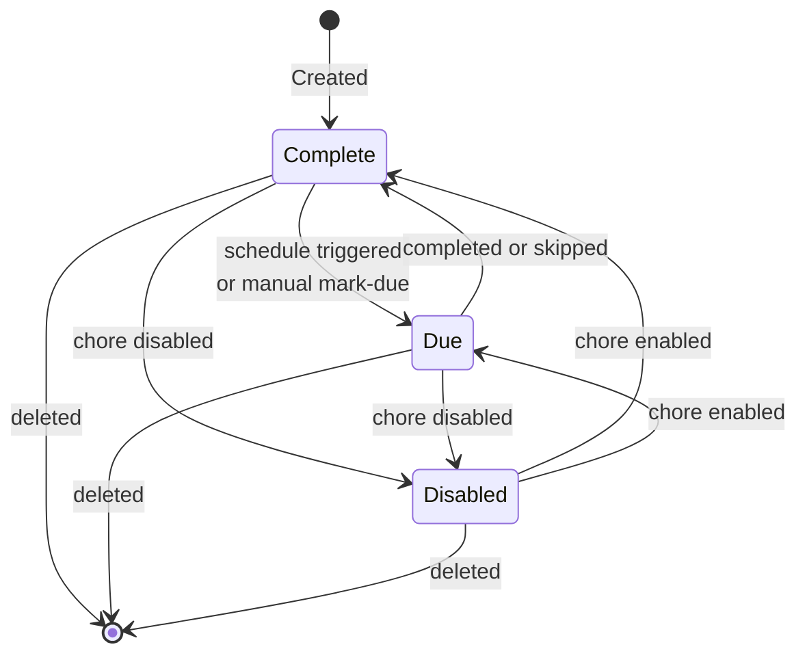
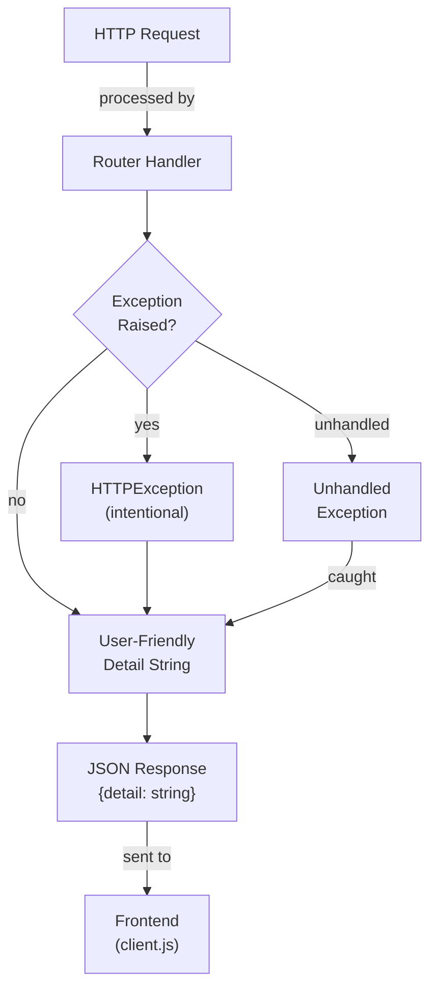
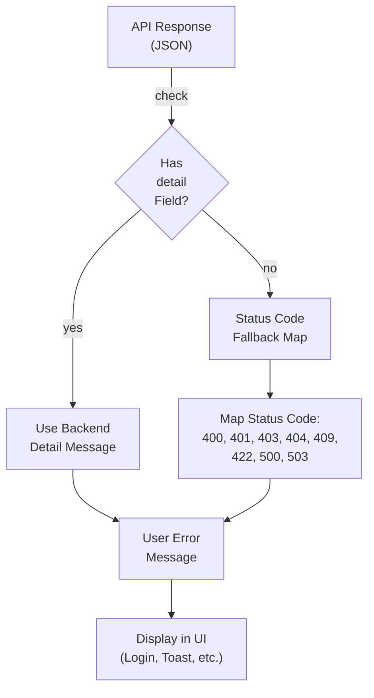
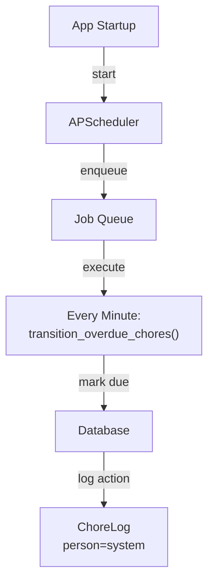
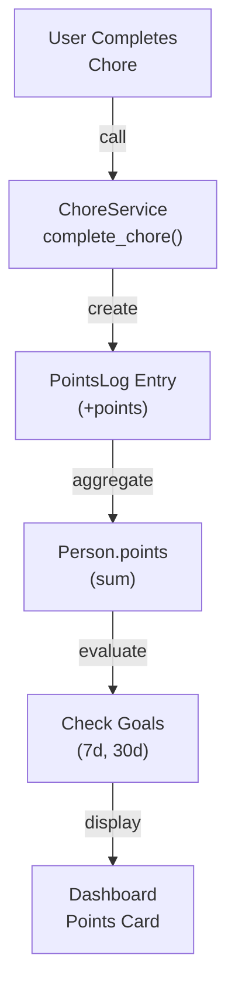

# Architecture Features

## Chore State Machine



## Theme System

```mermaid
graph TB
    Frontend["Frontend<br/>(ThemeSettings)"]
    API["Theme API"]
    Defaults["DEFAULT_THEMES<br/>(hardcoded)"]
    Memory["Custom Themes<br/>(in-memory)"]
    Database["Database<br/>(Person.preferred_theme)"]
    CSS["CSS Variables<br/>(--bg, --surface, etc)"]
    
    Frontend -->|GET /theme/list| API
    API -->|fetch| Defaults
    API -->|fetch| Memory
    API -->|themes list| Frontend
    
    Frontend -->|POST /theme/save| API
    API -->|store| Memory
    
    Frontend -->|POST /theme/set/{id}| API
    API -->|save| Database
    Database -->|update| Frontend
    
    Frontend -->|DELETE /theme/delete/{id}| API
    API -->|remove| Memory
    
    Frontend -->|apply| CSS
```

## Error Handling

Error handling spans both backend and frontend, ensuring users see clear, actionable messages instead of technical error codes.

### Backend Error Flow



**Backend Responsibilities:**
- **HTTPException handlers** provide user-readable `detail` strings (e.g., "Invalid input — check your values")
- **Global exception handler** (in `main.py`) catches unhandled exceptions and returns generic message: "Something went wrong. Please try again."
- All error responses use consistent `{"detail": "message"}` format

### Frontend Error Flow



**Frontend Responsibilities:**
- Prefer backend `detail` field if available
- Fall back to status code map when detail missing (network errors, missing response body)
- Never display raw HTTP status strings (e.g., "HTTP 500")
- Clean error display: remove prefixes like "ERROR: " from UI messages

### Status Code Fallback Map

When backend doesn't provide a detail message:

| Status | Message |
|--------|---------|
| 400 | Invalid input — check your values |
| 401 | Session expired, please log in |
| 403 | You don't have permission to do that |
| 404 | Not found |
| 409 | Already exists |
| 422 | Invalid input — check your values |
| 500 | Something went wrong. Please try again. |
| 503 | Service unavailable, please try again later |

## Scheduler Architecture



## Points & Scoring System

Points are awarded when users complete chores, with goal tracking over 7-day and 30-day rolling windows.



### Point Calculation

- **Award:** Chore completion = Chore.points awarded to person (by username)
- **Tracking:** PointsLog record created with (person=username, points, chore_id, completed_at)
- **Display:** `display_points = sum(PointsLog.points for person) - points_redeemed` — computed live from PointsLog
- **Person.points:** Running total kept in sync with PointsLog; incremented on completion, adjusted on admin edit/delete
- **Goals:** Rolling 7-day and 30-day windows calculated from PointsLog timestamps

### Models

- **Person.points** – Running total (floor 0); kept in sync with PointsLog sum
- **Person.goal_7d** – Target points for 7-day rolling window
- **Person.goal_30d** – Target points for 30-day rolling window
- **PointsLog** – Transaction log: (id, person, points, chore_id, completed_at)
  - `person` stores **username** (not display name)
  - Legacy entries with display name are normalized to username at startup

### Admin Points Log Management

When an admin edits or deletes a PointsLog entry via `PATCH /admin/db/points-log/{id}` or `DELETE /admin/db/points-log/{id}`, `Person.points` is adjusted to maintain consistency:

- **Points change only** (same person): `Person.points` adjusted by delta (`new - old`), floored at 0
- **Person reassignment** (different person, points same or changed): old person loses `old_points`, new person gains `new_points` — no double adjustment
- **Delete**: person loses the log's points, floored at 0
- **Person lookup**: matched by username or display name — handles any legacy entries not yet normalized
- **Missing person**: if no matching `Person` row found, that side's adjustment is silently skipped; operation still succeeds
