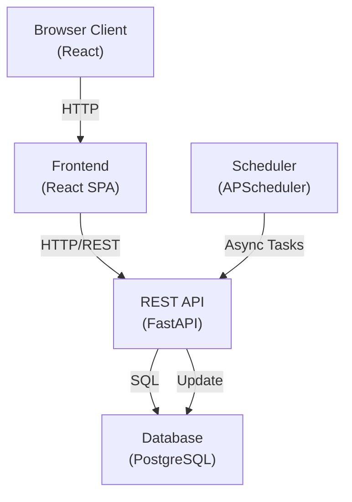
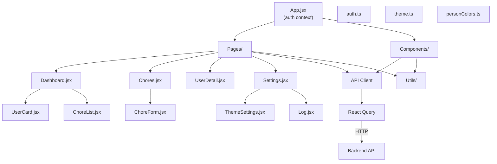
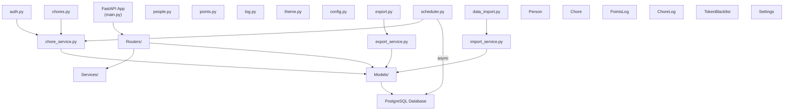
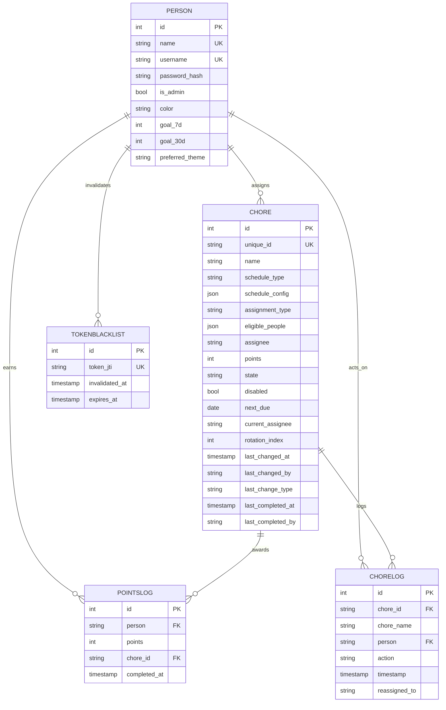
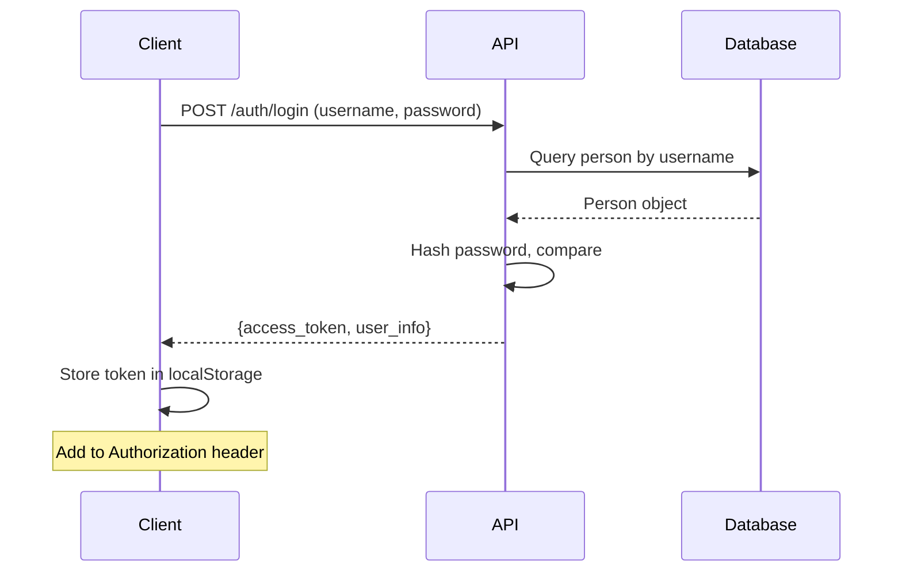
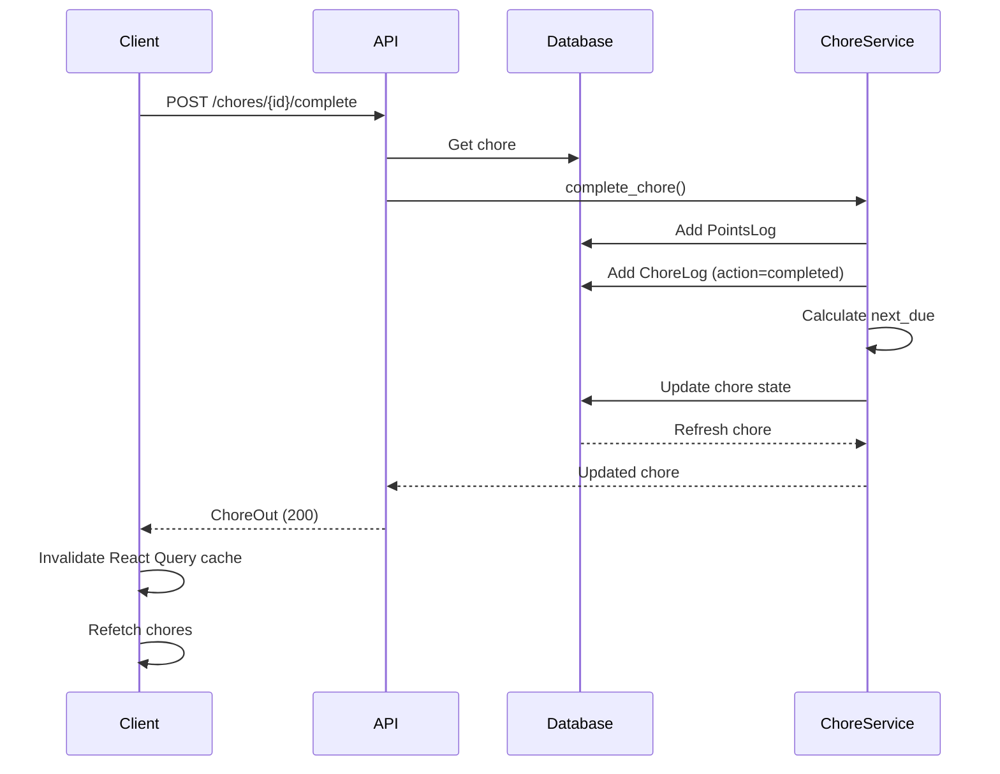
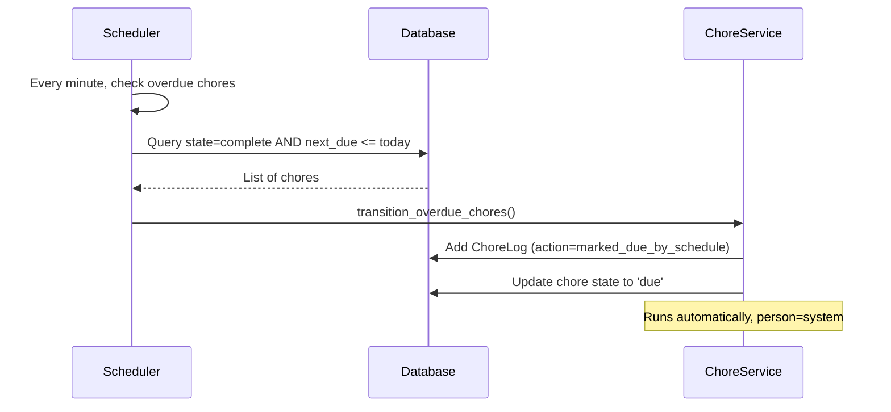
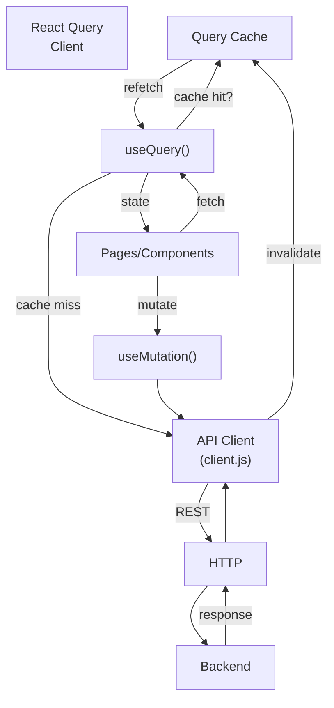
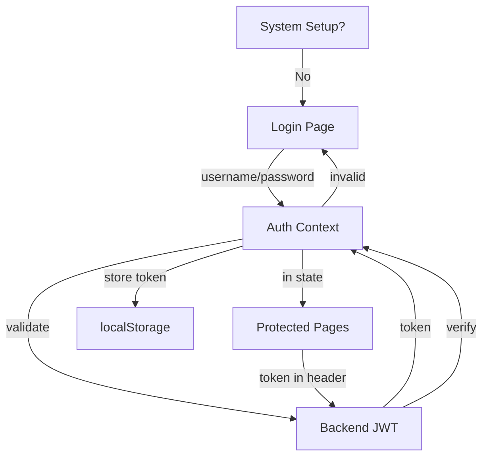

# Architecture Overview

## System Overview

## Frontend Architecture

## Backend Architecture

## Data Model

## Request/Response Flow

### Authentication

### Chore Completion

### Automatic Schedule Transition

## Frontend Data Flow

## Authentication Flow

